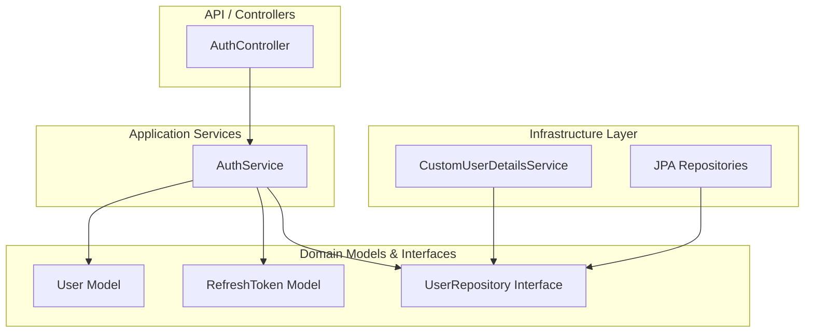
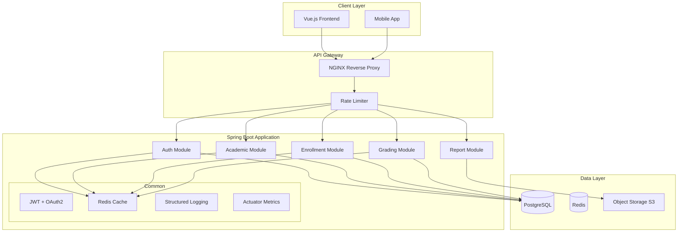

# CMS Project Architecture Review & Recommendations

**Date:** February 6, 2026  
**Reviewer:** Architecture Review  
**Project:** Course Management System (CMS) - vn.com.nws.cms

---

## Executive Summary

The CMS project demonstrates **good foundational architecture** with a professional documentation suite and a well-structured Auth module following Clean Architecture principles. However, the project has **significant gaps** between documented requirements and actual implementation. The current state is approximately **35-40% complete** relative to enterprise standards.

### Overall Assessment

| Category | Score | Notes |
|----------|-------|-------|
| Architecture Design | 7/10 | Good layered approach, inconsistent module implementation |
| Code Quality | 5/10 | TODO comments, incomplete features, security concerns |
| Security | 4/10 | Weak JWT secrets, incomplete token management |
| Documentation | 9/10 | Comprehensive but not synchronized with code |
| Scalability | 4/10 | Missing caching, rate limiting, circuit breakers |
| Test Coverage | 2/10 | Only basic Spring context test exists |

---

## 1. Architecture Analysis

### 1.1 Current Architecture Pattern

The project adopts **Clean Architecture** with layered separation:



### 1.2 Architecture Strengths

1. **Clean Auth Module**: The `modules/auth/` package properly implements:
   - `domain/model/` - Business entities (User, RefreshToken)
   - `domain/repository/` - Repository interfaces (abstractions)
   - `application/` - Use case services (AuthService)
   - `api/` - REST controllers and DTOs
   - `infrastructure/` - Implementation details

2. **Proper Use of Abstractions**:
   - Repository pattern with JPA implementations
   - Dependency injection via Spring
   - DTOs for API communication

3. **Good Documentation Suite**:
   - Comprehensive SRS (Software Requirements Specification)
   - Detailed API documentation
   - Database schema designs
   - Use case flows with Mermaid diagrams

### 1.3 Architecture Weaknesses

#### 1.3.1 Inconsistent Module Structure

**Problem:** Other modules (Academic, Enrollment, Grading) are not implemented following the Auth module pattern:

```
src/main/java/vn/com/nws/cms/
├── academic/
│   ├── course/ [EMPTY - NO FILES]
│   ├── section/ [EMPTY - NO FILES]
│   └── semester/ [EMPTY - NO FILES]
├── enrollment/ [EMPTY - NO FILES]
├── grading/ [EMPTY - NO FILES]
├── modules/auth/ [PROPERLY STRUCTURED]
└── cms/ [DUPLICATE/LEGACY PACKAGE STRUCTURE]
```

**Impact:** Maintains legacy code, violates DRY principle, inconsistent maintenance burden.

#### 1.3.2 Hybrid Package Structure

The project has two parallel structures:
1. **New Clean Architecture**: `vn.com.nws.cms.modules.auth.*`
2. **Legacy Structure**: `vn.com.nws.cms.academic.*`, `vn.com.nws.cms.enrollment.*`

This creates confusion and maintenance burden.

---

## 2. Critical Issues

### 2.1 Security Vulnerabilities

#### 2.1.1 Weak JWT Secret

**Location:** [`src/main/resources/application.properties`](src/main/resources/application.properties:9)

```properties
jwt.secret=12345678901234567890123456789012
```

**Issue:** 
- Only 32 characters (256 bits) but should be at least 256 bits for HS256
- Contains sequential characters (predictable pattern)
- **Severity:** CRITICAL

**Recommendation:**
```properties
jwt.secret=${JWT_SECRET:Your256BitSecretKeyHereMustBeComplex!}
```

#### 2.1.2 Incomplete Password Reset

**Location:** [`AuthService.java`](src/main/java/vn/com/nws/cms/modules/auth/application/AuthService.java:136-153)

```java
public void forgotPassword(ForgotPasswordRequest request) {
    // TODO: Store reset token in DB or use a separate ResetToken entity
    // For simplicity in this demo without Redis, we are just logging it.
    log.info("Reset Password Token for {}: {}", user.getEmail(), resetToken);
}

@Transactional
public void resetPassword(ResetPasswordRequest request) {
    // TODO: Validate token against DB
    throw new BusinessException("Reset password functionality requires DB implementation for token storage");
}
```

**Impact:** Password reset is completely non-functional.

#### 2.1.3 Refresh Token Not Cryptographically Signed

**Location:** [`JwtProvider.java`](src/main/java/vn/com/nws/cms/common/security/JwtProvider.java:58-60)

```java
public String generateRefreshToken(String username) {
    return UUID.randomUUID().toString();
}
```

**Issue:** Refresh tokens are simple UUIDs without cryptographic signatures.

**Recommendation:** Sign refresh tokens or store them in Redis with proper validation.

### 2.2 Code Quality Issues

#### 2.2.1 JPA Annotations in Domain Model

**Location:** [`User.java`](src/main/java/vn/com/nws/cms/modules/auth/domain/model/User.java:10-16)

```java
@Entity
@Table(name = "users")
@Data
@Builder
@NoArgsConstructor
@AllArgsConstructor
public class User extends AuditEntity {
    @Id
    @GeneratedValue(strategy = GenerationType.IDENTITY)
    private Long id;
    // ... other fields with @Column annotations
}
```

**Issue:** Violates pure Clean Architecture principle where Domain Layer should be framework-agnostic.

**Recommendation:** Create separate `UserEntity` for persistence and keep `User` as POJO.

#### 2.2.2 TODO Comments in Production Code

| File | Line | TODO |
|------|------|------|
| AuthService.java | 142 | Store reset token in DB |
| AuthService.java | 152 | Validate token against DB |
| AuthService.java | 144 | Create PasswordResetToken entity |

**Impact:** Technical debt accumulation.

#### 2.2.3 Overly Broad Exception Handling

**Location:** [`GlobalExceptionHandler.java`](src/main/java/vn/com/nws/cms/common/exception/GlobalExceptionHandler.java:17-21)

```java
@ExceptionHandler(Exception.class)
public ResponseEntity<ApiResponse<Void>> handleException(Exception e) {
    return ResponseEntity.status(HttpStatus.INTERNAL_SERVER_ERROR)
            .body(ApiResponse.error(500, e.getMessage()));
}
```

**Issue:** Catches ALL exceptions including unchecked exceptions, exposing internal details.

**Recommendation:** Log exception details server-side, return generic error to client.

### 2.3 Configuration Issues

#### 2.3.1 Disabled Database Migration

**Location:** [`src/main/resources/application.properties`](src/main/resources/application.properties:3)

```properties
spring.flyway.enabled=false
```

**Impact:** Manual schema management required.

#### 2.3.2 Incomplete Redis Configuration

**Issue:** Documentation mentions Redis for token caching, but code doesn't use it.

**Expected:** `auth:rt:{username}` → Refresh Token storage in Redis with TTL

**Actual:** Refresh tokens stored only in PostgreSQL database

---

## 3. Missing Enterprise Features

### 3.1 Backend Missing Components

| Feature | Status | Priority |
|---------|--------|----------|
| API Versioning | ❌ Missing | Medium |
| Rate Limiting | ❌ Missing | High |
| Circuit Breaker | ❌ Missing | Medium |
| API Documentation (Swagger) | ⚠️ Partial | Low |
| Logging Framework | ⚠️ Basic | Medium |
| Monitoring/Metrics | ❌ Missing | Medium |
| Health Checks | ❌ Missing | High |
| Unit Tests | ⚠️ 1 test only | Critical |
| Integration Tests | ❌ Missing | Critical |
| Performance Tests | ❌ Missing | Low |

### 3.2 Frontend Missing Components

| Feature | Status | Priority |
|---------|--------|----------|
| Auth Store (Pinia) | ❌ Missing | Critical |
| API Service Layer | ⚠️ Basic axios only | High |
| Route Guards | ❌ Missing | High |
| Error Handling | ❌ Missing | Medium |
| Loading States | ❌ Missing | Medium |
| i18n Implementation | ⚠️ Installed only | Medium |
| Component Library | ❌ Missing | Medium |
| Form Validation | ❌ Missing | High |
| HTTP Interceptors | ❌ Missing | High |

---

## 4. Module Completion Status

### 4.1 Backend Module Matrix

| Module | Entities | Repositories | Services | Controllers | Tests |
|--------|---------|--------------|----------|-------------|-------|
| Auth | ✅ 2 | ✅ 2 | ✅ 1 | ✅ 1 | ❌ 0 |
| Academic | ❌ 0 | ❌ 0 | ❌ 0 | ❌ 0 | ❌ 0 |
| Enrollment | ❌ 0 | ❌ 0 | ❌ 0 | ❌ 0 | ❌ 0 |
| Grading | ❌ 0 | ❌ 0 | ❌ 0 | ❌ 0 | ❌ 0 |
| User | ❌ 0 | ❌ 0 | ❌ 0 | ❌ 0 | ❌ 0 |
| Report | ❌ 0 | ❌ 0 | ❌ 0 | ❌ 0 | ❌ 0 |

### 4.2 Frontend Module Matrix

| Feature | Views | Components | Stores | Services |
|---------|-------|------------|--------|----------|
| Auth | ✅ 1 | ❌ 0 | ❌ 0 | ❌ 0 |
| Dashboard | ✅ 1 | ❌ 0 | ❌ 0 | ❌ 0 |
| Academic | ❌ 0 | ❌ 0 | ❌ 0 | ❌ 0 |
| Enrollment | ❌ 0 | ❌ 0 | ❌ 0 | ❌ 0 |
| Grading | ❌ 0 | ❌ 0 | ❌ 0 | ❌ 0 |

---

## 5. Recommendations

### 5.1 Immediate Actions (Week 1-2)

#### 5.1.1 Security Hardening

1. **Fix JWT Secret**:
   ```bash
   # Generate secure secret
   openssl rand -hex 64
   ```

2. **Enable HTTPS in Production**
3. **Implement Rate Limiting**:
   ```java
   @Configuration
   @EnableRedisHttpSession
   public class RateLimitConfig {
       // Configure Redis-based rate limiting
   }
   ```

#### 5.1.2 Complete Password Reset Flow

Create `PasswordResetToken` entity and implement full flow:

```java
@Entity
@Table(name = "password_reset_tokens")
public class PasswordResetToken {
    @Id @GeneratedValue
    private Long id;
    
    private String token;
    
    @OneToOne
    private User user;
    
    private Instant expiryDate;
}
```

#### 5.1.3 Add Essential Tests

```java
@SpringBootTest
@AutoConfigureMockMvc
class AuthIntegrationTest {
    @Test
    void login_WithValidCredentials_ReturnsToken() { }
    
    @Test
    void login_WithInvalidCredentials_Returns401() { }
    
    @Test
    void refreshToken_WithValidToken_ReturnsNewTokens() { }
}
```

### 5.2 Short-term Actions (Month 1)

#### 5.2.1 Complete Auth Module

1. **Add Redis Token Storage**
2. **Implement Token Blacklist**
3. **Add Session Management**
4. **Implement Keycloak Integration** (per documentation)

#### 5.2.2 Build Academic Module

Implement full CRUD following Auth module pattern:

```
academic/
├── course/
│   ├── domain/
│   │   ├── model/Course.java
│   │   ├── repository/CourseRepository.java
│   │   └── service/CourseService.java
│   ├── api/
│   │   ├── CourseController.java
│   │   └── dto/
│   └── application/
│       └── CourseUseCase.java
```

#### 5.2.3 Frontend Architecture

```
frontend/src/
├── api/
│   ├── axios.ts          # Base axios instance with interceptors
│   ├── auth.ts           # Auth API calls
│   └── modules/
│       ├── academic/
│       ├── enrollment/
│       └── grading/
├── stores/
│   ├── auth.ts           # Pinia auth store
│   └── config.ts
├── composables/          # Vue composables
├── components/
│   ├── common/           # Reusable UI components
│   └── modules/          # Feature-specific components
└── views/
    ├── auth/
    ├── dashboard/
    └── modules/
```

### 5.3 Medium-term Actions (Month 2-3)

#### 5.3.1 Infrastructure Improvements

| Component | Action |
|-----------|--------|
| Caching | Implement Redis caching for frequently accessed data |
| Logging | Add structured logging (JSON format) |
| Monitoring | Add Micrometer metrics and Actuator endpoints |
| API Versioning | Implement URL-based or header-based versioning |
| Circuit Breaker | Add Resilience4j configuration |

#### 5.3.2 Complete Remaining Modules

- Enrollment Module
- Grading Module
- Report Module (PDF export)
- Notification Module

### 5.4 Long-term Actions (Month 4+)

#### 5.4.1 Advanced Features

1. **E-learning Integration**
   - SCORM support
   - xAPI statements collection
   - Learning Record Store (LRS)

2. **Performance Optimization**
   - Database query optimization
   - Connection pooling tuning
   - Horizontal scaling support

3. **Enhanced Security**
   - Two-Factor Authentication (2FA)
   - Single Sign-On (SSO)
   - Audit Logging
   - GDPR Compliance

---

## 6. Technology Stack Recommendations

### 6.1 Backend Stack (Current vs Recommended)

| Component | Current | Recommended |
|-----------|---------|-------------|
| Java Version | 21 ✅ | 21 ✅ |
| Spring Boot | 4.0.2 ✅ | 4.0.2 ✅ |
| Database | PostgreSQL ✅ | PostgreSQL ✅ |
| Caching | Not implemented | Redis ✅ |
| API Docs | SpringDoc ✅ | SpringDoc + Redoc |
| Auth | Custom JWT + DB | JWT + Redis + Keycloak |
| Testing | Basic | JUnit 5 + Mockito + Testcontainers |

### 6.2 Frontend Stack (Current vs Recommended)

| Component | Current | Recommended |
|-----------|---------|-------------|
| Framework | Vue 3 ✅ | Vue 3 + Composition API |
| State | Pinia ✅ | Pinia + Persist plugin |
| Router | Vue Router ✅ | Vue Router + guards |
| HTTP | Axios ✅ | Axios + interceptors |
| UI Library | None | Element Plus / Vuetify |
| Forms | None | VeeValidate / FormKit |
| i18n | vue-i18n ✅ | vue-i18n + lazy loading |
| Build | Vite ✅ | Vite ✅ |

---

## 7. Architecture Diagram - Recommended Future State



---

## 8. Conclusion

### 8.1 Project Health Score

| Metric | Score |
|--------|-------|
| Architecture | 65% |
| Security | 40% |
| Code Quality | 50% |
| Test Coverage | 10% |
| Documentation | 90% |
| **Overall** | **51%** |

### 8.2 Summary

The CMS project has **excellent documentation** and a **solid foundation** in the Auth module. However, significant work is needed to reach enterprise standards:

1. **Security First**: Fix JWT secrets, complete password reset, add rate limiting
2. **Complete Core Modules**: Build Academic, Enrollment, Grading modules
3. **Testing**: Add comprehensive unit and integration tests
4. **Infrastructure**: Implement Redis caching, proper logging, monitoring
5. **Frontend**: Build complete auth store, API layer, and route guards

### 8.3 Path Forward

1. **Week 1-2**: Security hardening + complete password reset
2. **Week 3-4**: Build Academic module (Course, Semester, Section)
3. **Month 2**: Build Enrollment and Grading modules
4. **Month 3**: Frontend completion + integration
5. **Month 4+**: Performance optimization, E-learning features

---

## Appendix A: File Reference Matrix

| File | Lines | Purpose | Quality |
|------|-------|---------|---------|
| `modules/auth/domain/model/User.java` | 33 | Domain entity | Medium |
| `modules/auth/application/AuthService.java` | 154 | Auth use cases | Low |
| `modules/auth/api/AuthController.java` | 55 | REST controller | High |
| `common/config/SecurityConfig.java` | 63 | Security config | Medium |
| `common/security/JwtProvider.java` | 61 | JWT handling | Low |
| `common/exception/GlobalExceptionHandler.java` | 40 | Exception handling | Low |
| `pom.xml` | 164 | Dependencies | Medium |
| `docs/API_AUTH.md` | 140 | API documentation | High |
| `docs/DATABASE_SCHEMA.md` | 176 | DB design | High |
| `docs/SRS.md` | 76 | Requirements | High |

---

## Appendix B: Risk Assessment

| Risk | Impact | Probability | Mitigation |
|------|--------|-------------|------------|
| Security breach (weak JWT) | Critical | Medium | Immediate secret rotation |
| Data loss (no backups) | Critical | Low | Implement backup strategy |
| Scope creep | High | High | Define MVP clearly |
| Technical debt | Medium | High | Dedicate 20% time to refactoring |
| Integration issues | Medium | Medium | Early integration testing |
