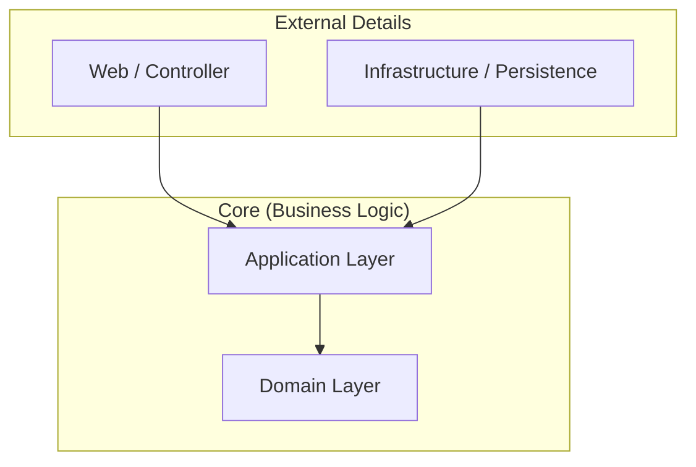

# Hướng dẫn Clean Architecture & Database Independence

Tài liệu này định nghĩa cách tổ chức mã nguồn để đảm bảo Business Logic (Core) hoàn toàn độc lập với Framework, Database, và UI, cho phép thay thế cơ sở dữ liệu (SQL/NoSQL) mà không ảnh hưởng đến nghiệp vụ.

## 1. Nguyên lý Cốt lõi (The Dependency Rule)
Quy tắc quan trọng nhất: **Sự phụ thuộc mã nguồn chỉ được trỏ vào trong (hướng về phía Domain).**
*   Lớp bên trong không được biết bất cứ điều gì về lớp bên ngoài.
*   Domain không phụ thuộc vào Database, Web, hay Framework.

## 2. Chi tiết Các Tầng (Layers)

### 2.1. Domain Layer (Trái tim của hệ thống)
*   **Chứa**: Entities, Value Objects, Domain Services, và **Repository Interfaces**.
*   **Đặc điểm**:
    *   POJO thuần túy (Plain Old Java Object).
    *   Không có annotation của JPA/Hibernate (`@Entity`, `@Table` - *Lý tưởng nhất, nhưng để thực tế với Spring Boot, ta thường chấp nhận dùng JPA annotation ở đây hoặc dùng mô hình tách biệt hoàn toàn nếu cần sự độc lập tuyệt đối*).
    *   **Repository Interfaces**: Định nghĩa *Hợp đồng* (Contract) để truy xuất dữ liệu. Ví dụ: `findUserById()`, `saveOrder()`.

### 2.2. Application Layer (Use Cases)
*   **Chứa**: Service Classes, DTOs (Data Transfer Objects), Mappers.
*   **Nhiệm vụ**:
    *   Điều phối luồng công việc (Orchestration).
    *   Gọi Domain Objects để thực hiện logic nghiệp vụ.
    *   Chuyển đổi dữ liệu giữa Core và External.
*   **Đặc điểm**: Độc lập với Web (không có `HttpServletRequest`) và Database (không có SQL query).

### 2.3. Infrastructure Layer (Triển khai chi tiết)
*   **Chứa**: Repository Implementations (JPA, Mongo, JDBC), External API Clients, File System Access.
*   **Nhiệm vụ**: Thực thi các Interface được định nghĩa ở Domain Layer.
*   **Ví dụ**:
    *   `JpaUserRepository` (dùng PostgreSQL).
    *   Nếu muốn đổi sang MongoDB -> Tạo `MongoUserRepository` -> Thay thế bean config -> Core không đổi.

### 2.4. API / Web Layer (Giao tiếp)
*   **Chứa**: Controllers, Exception Handlers.
*   **Nhiệm vụ**: Nhận Request HTTP, validate input, gọi Application Service, trả về Response.

## 3. Chiến lược Độc lập Database (Database Agnostic)

Để dễ dàng chuyển đổi giữa MySQL, PostgreSQL, hay MongoDB:

1.  **Repository Pattern**:
    *   Domain định nghĩa: `interface UserRepository { User save(User user); }`
    *   Infrastructure implement: `class PostgresUserRepository implements UserRepository { ... }`

2.  **Tách biệt Entity**:
    *   **Domain Entity**: Chỉ chứa logic nghiệp vụ (`User.java`).
    *   **Persistence Entity**: Chứa annotation của DB (`UserEntity.java` với `@Entity`, `@Id`, `@Column`).
    *   **Mapper**: Chuyển đổi giữa Domain Entity <-> Persistence Entity tại tầng Infrastructure.
    *   *Lưu ý*: Cách này tốn công sức (boilerplate code) nhưng đảm bảo Core sạch 100%. Với dự án vừa và nhỏ, có thể chấp nhận dùng chung Entity nếu DB vẫn là hệ Relational (SQL).

## 4. Các Module Cần Thiết (Dự kiến)

Để hoàn thiện hệ thống theo Clean Architecture, ngoài `Auth`, `User`, `Academic`, cần thêm:

1.  **Storage Module**:
    *   Mục đích: Quản lý file (Avatar, Tài liệu học tập).
    *   Abstraction: `StorageService` (Interface).
    *   Implementation: `LocalStorage`, `S3Storage`, `MinIO`.
2.  **Notification Module**:
    *   Mục đích: Gửi thông báo (Email, Push, SMS).
    *   Abstraction: `NotificationSender` (Interface).
    *   Implementation: `JavaMailSender`, `FirebaseFCM`.
3.  **Audit Log Module**:
    *   Mục đích: Ghi vết hệ thống độc lập.
    *   Lưu trữ: Có thể dùng ElasticSearch hoặc File log.
