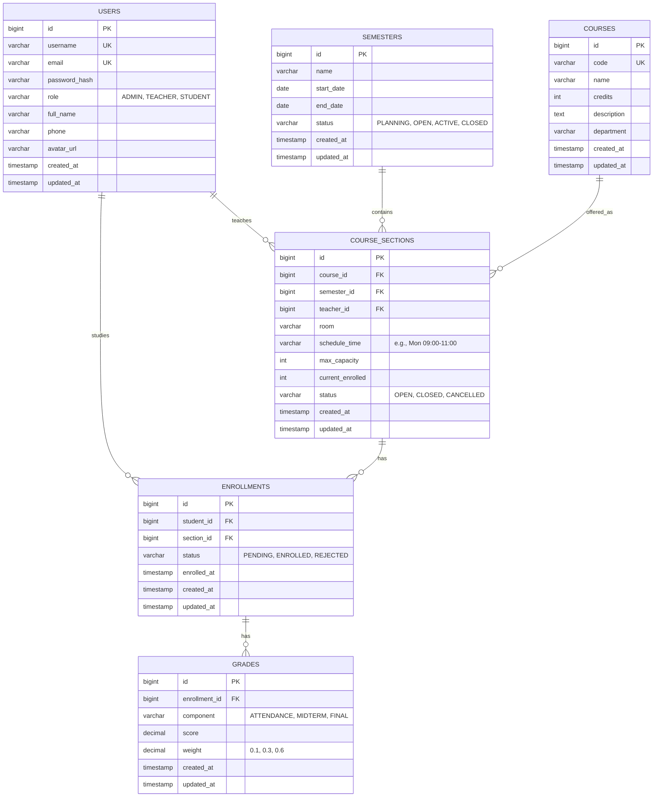

# Thiết kế Cơ sở dữ liệu (Database Schema)

Tài liệu này mô tả chi tiết cấu trúc cơ sở dữ liệu cho hệ thống CMS, bao gồm sơ đồ quan hệ thực thể (ERD) và đặc tả chi tiết các bảng.

## 1. Sơ đồ Quan hệ Thực thể (ER Diagram)

## 2. Đặc tả Chi tiết Bảng (Table Specifications)

### 2.1. Module Auth & User

#### Bảng `users`
Lưu trữ thông tin người dùng hệ thống.
| Cột | Kiểu dữ liệu | Ràng buộc | Mô tả |
| :--- | :--- | :--- | :--- |
| `id` | BIGSERIAL | PK | ID tự tăng |
| `username` | VARCHAR(50) | UNIQUE, NOT NULL | Tên đăng nhập |
| `password` | VARCHAR(255) | NOT NULL | Mật khẩu đã mã hóa (BCrypt) |
| `email` | VARCHAR(100) | UNIQUE, NOT NULL | Email người dùng |
| `role` | VARCHAR(20) | NOT NULL | Vai trò: `ROLE_ADMIN`, `ROLE_TEACHER`, `ROLE_STUDENT` |
| `full_name` | VARCHAR(100) | | Họ và tên đầy đủ |
| `phone` | VARCHAR(15) | | Số điện thoại |
| `avatar_url` | TEXT | | Link ảnh đại diện |
| `created_at` | TIMESTAMP | DEFAULT NOW() | Thời điểm tạo |
| `updated_at` | TIMESTAMP | DEFAULT NOW() | Thời điểm cập nhật cuối |

### 2.2. Module Academic (Học vụ)

#### Bảng `semesters` (Học kỳ)
| Cột | Kiểu dữ liệu | Ràng buộc | Mô tả |
| :--- | :--- | :--- | :--- |
| `id` | BIGSERIAL | PK | ID tự tăng |
| `name` | VARCHAR(100) | NOT NULL | Tên học kỳ (VD: Học kỳ 1 Năm 2023-2024) |
| `start_date` | DATE | NOT NULL | Ngày bắt đầu |
| `end_date` | DATE | NOT NULL | Ngày kết thúc |
| `status` | VARCHAR(20) | NOT NULL | Trạng thái: `PLANNING`, `OPEN_FOR_REGISTRATION`, `ACTIVE`, `CLOSED` |

#### Bảng `courses` (Môn học)
Dữ liệu danh mục môn học (không thay đổi theo kỳ).
| Cột | Kiểu dữ liệu | Ràng buộc | Mô tả |
| :--- | :--- | :--- | :--- |
| `id` | BIGSERIAL | PK | ID tự tăng |
| `code` | VARCHAR(20) | UNIQUE, NOT NULL | Mã môn học (VD: INT3306) |
| `name` | VARCHAR(255) | NOT NULL | Tên môn học |
| `credits` | INT | NOT NULL, > 0 | Số tín chỉ |
| `department` | VARCHAR(100) | | Khoa/Bộ môn quản lý |
| `description` | TEXT | | Mô tả đề cương môn học |

#### Bảng `course_sections` (Lớp học phần)
Lớp học cụ thể được mở trong một học kỳ.
| Cột | Kiểu dữ liệu | Ràng buộc | Mô tả |
| :--- | :--- | :--- | :--- |
| `id` | BIGSERIAL | PK | ID tự tăng |
| `course_id` | BIGINT | FK -> courses(id) | Tham chiếu môn học |
| `semester_id` | BIGINT | FK -> semesters(id) | Tham chiếu học kỳ |
| `teacher_id` | BIGINT | FK -> users(id) | Giảng viên giảng dạy (User có role TEACHER) |
| `room` | VARCHAR(50) | | Phòng học |
| `schedule_time` | VARCHAR(100) | | Thời khóa biểu (VD: Thứ 2, Tiết 1-3) |
| `max_capacity` | INT | NOT NULL | Sĩ số tối đa |
| `current_enrolled` | INT | DEFAULT 0 | Số lượng đã đăng ký hiện tại |
| `status` | VARCHAR(20) | NOT NULL | `OPEN` (Còn chỗ), `FULL` (Đầy), `CANCELLED` (Hủy) |

### 2.3. Module Enrollment (Đăng ký)

#### Bảng `enrollments`
Bản ghi đăng ký học của sinh viên.
| Cột | Kiểu dữ liệu | Ràng buộc | Mô tả |
| :--- | :--- | :--- | :--- |
| `id` | BIGSERIAL | PK | ID tự tăng |
| `student_id` | BIGINT | FK -> users(id) | Sinh viên đăng ký |
| `section_id` | BIGINT | FK -> course_sections(id) | Lớp học phần |
| `status` | VARCHAR(20) | NOT NULL | `ENROLLED` (Đã đăng ký), `CANCELLED` (Đã hủy) |
| `enrolled_at` | TIMESTAMP | DEFAULT NOW() | Thời điểm đăng ký |

*Ràng buộc Unique*: `(student_id, section_id)` - Sinh viên không thể đăng ký 1 lớp 2 lần.

### 2.4. Module Grading (Điểm số)

#### Bảng `grades`
Chi tiết điểm thành phần.
| Cột | Kiểu dữ liệu | Ràng buộc | Mô tả |
| :--- | :--- | :--- | :--- |
| `id` | BIGSERIAL | PK | ID tự tăng |
| `enrollment_id` | BIGINT | FK -> enrollments(id) | Tham chiếu bản ghi đăng ký |
| `component` | VARCHAR(20) | NOT NULL | Đầu điểm: `ATTENDANCE`, `MIDTERM`, `FINAL`, `PRACTICE` |
| `score` | DECIMAL(4, 2) | CHECK (0 <= score <= 10) | Điểm số (thang 10) |
| `weight` | DECIMAL(3, 2) | CHECK (0 < weight <= 1) | Trọng số (VD: 0.1, 0.3) |

## 3. Redis Schema (Caching & Auth)

Ngoài Database quan hệ (PostgreSQL), hệ thống sử dụng Redis cho các dữ liệu tạm thời:

1.  **Authentication**:
    *   `auth:rt:{username}` -> `Refresh Token` (String). TTL: 7 days.
    *   `auth:reset:{token}` -> `username` (String). TTL: 15 mins (Quên mật khẩu).

2.  **Caching (Dự kiến)**:
    *   `cms:courses:all` -> List danh sách môn học (Ít thay đổi).
    *   `cms:semester:active` -> Thông tin học kỳ đang hoạt động.
