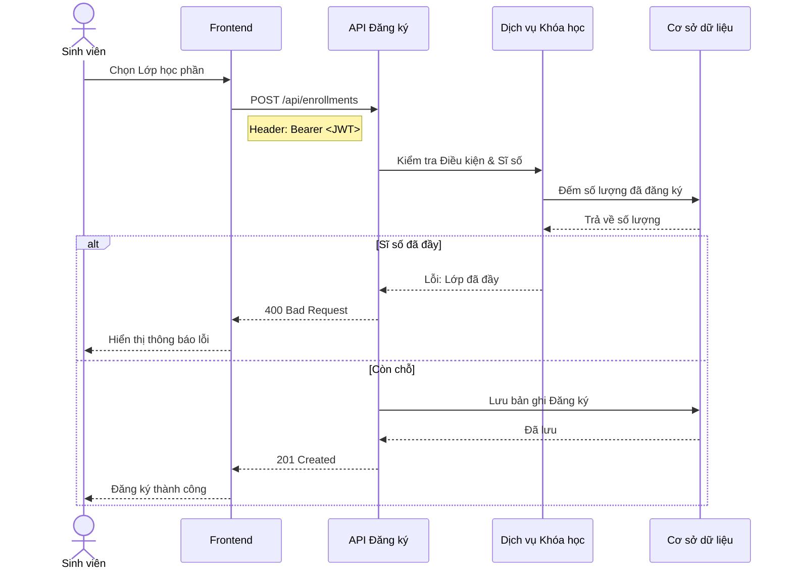
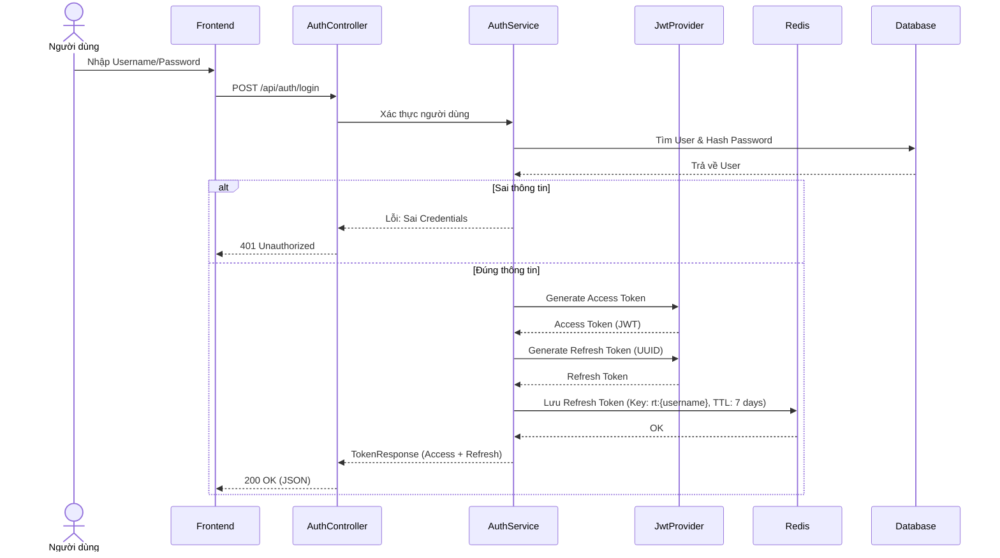
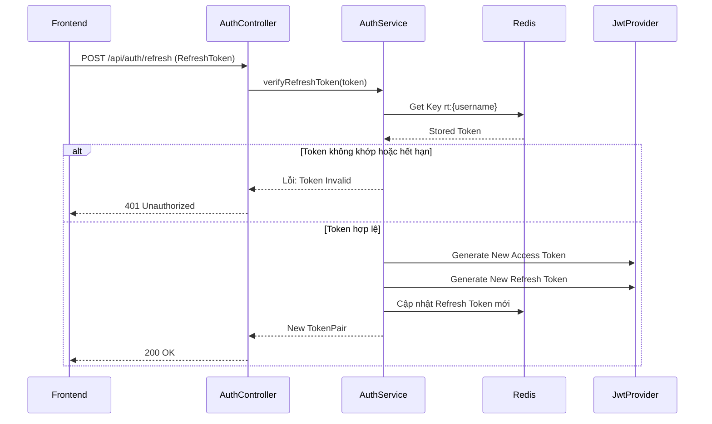

# Luồng Use Case (Use Case Flows)

## 1. Luồng Đăng ký học của Sinh viên
*(Giữ nguyên luồng này)*

## 2. Luồng Nhập điểm của Giảng viên
*(Giữ nguyên luồng này)*

## 3. Luồng Đăng nhập (Custom JWT + Redis)

## 4. Luồng Refresh Token

